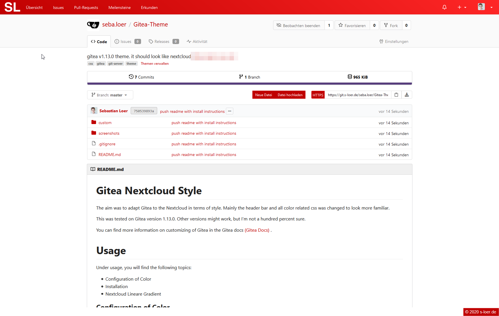
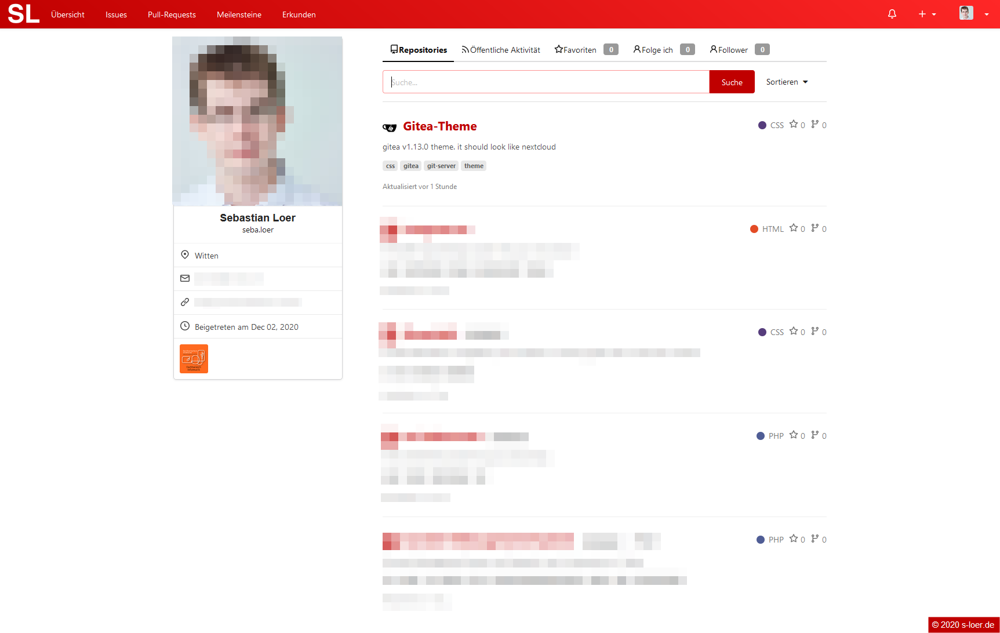
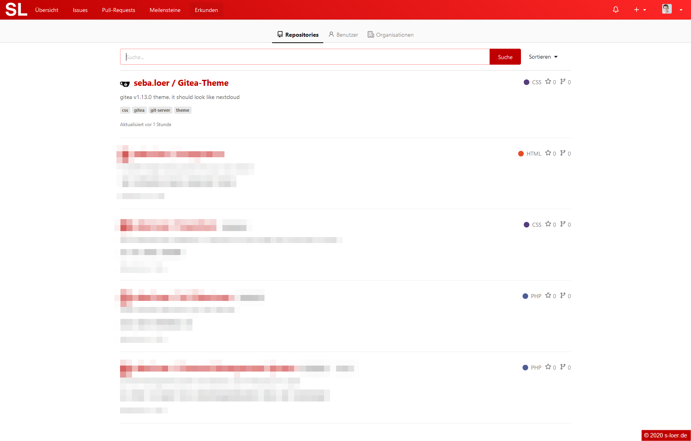
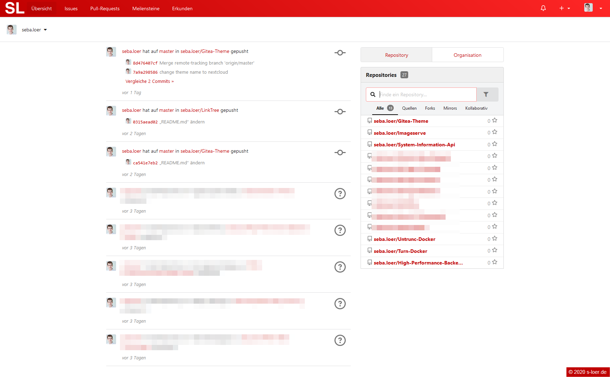

# Gitea Nextcloud Style

The aim was to adapt Gitea to the Nextcloud in terms of style. Mainly the header bar and all color related css was changed to look more familiar.

This was tested on Gitea version 1.13.0. Other versions might work, but I'm not a hundred percent sure.

You can find more information on customizing of Gitea in the Gitea docs [(Gitea Docs)](https://docs.gitea.io/en-us/customizing-gitea/)
.

# Usage

Under usage, you will find the following topics:
- Configuration of Color
- Installation
- Nextcloud Linear Gradient

### Configuration of Color

You need to change the css values in the nextcloud-theme.css file. In Line 8 to 20 the colors are set. \
The default values correspond to the default nextcloud colors.

```
body {
    --primary-color: #c00000;
    --primary-color-light: #ff2727;
    --text-primary-color: #ffffff;
    --input-focus-color: #fd9494;

    --heatmap-0: #FAFAFA;
    --heatmap-1: #e17500;
    --heatmap-2: #e16100;
    --heatmap-3: #e14d00;
    --heatmap-4: #e13300;
    --heatmap-5: #c30000;
}

```

### Installation

If you want to use this style sheets you need to go to your installation location of your Gitea server and upload the files into the ``custom`` folder.

> Make all changes before uploading the files. Otherwise, you may experience problems with caching.

The structure should look something like this:
```
gitea
    custom\
        public\
            css\
            fonts\
            img\
        templates\
            custom\
    ...
```

After that you need to restart your Gitea server. \
If you installed the Gitea server with a system service you can simply run ``systemctl restart gitea``. [(Gitea Docs)](https://docs.gitea.io/en-us/linux-service/) \
If you run your Gitea service with Docker you can simply run ``docker restart CONTAINER`` [(Docker Docs)](https://docs.docker.com/engine/reference/commandline/restart/)

After the restart the styles should be loaded, and the look of your side should have changed.

Sometimes when you edited the files there could be a problem with the caching of the gitea server. \
Just rename the files restart the server and rename them back as a dirty fix.


### Nextcloud Custom Color with Linear Gradient

If you also want to use the linear gradient which is used in this style and served with the default nextcloud theme. \
You need to add some custom css to your nextcloud server. \
For this I used the [Custom CSS Plugin](https://apps.nextcloud.com/apps/theming_customcss) which adds a custom css input box to the admin theming page. \
There you can simply add this css snippet:
```
#body-user #header, #body-settings #header, #body-public #header {
  background-image: linear-gradient(40deg, var(--color-primary) 0%, var(--color-primary-element-light) 100%);
}
```

# Fonts

todo need add links to license `` custom/public/fonts/LICENSE.txt | OFL.txt``

Nonito: [Licensed under SIL Open Font License](custom/public/fonts/OFL.txt) \
OpenSans: [Licensed under Apache License (v2)](custom/public/fonts/LICENSE.txt)

# Screenshots

#### Repository Page
 

#### Profile Page
 

#### Explore Page


#### Overview Page
